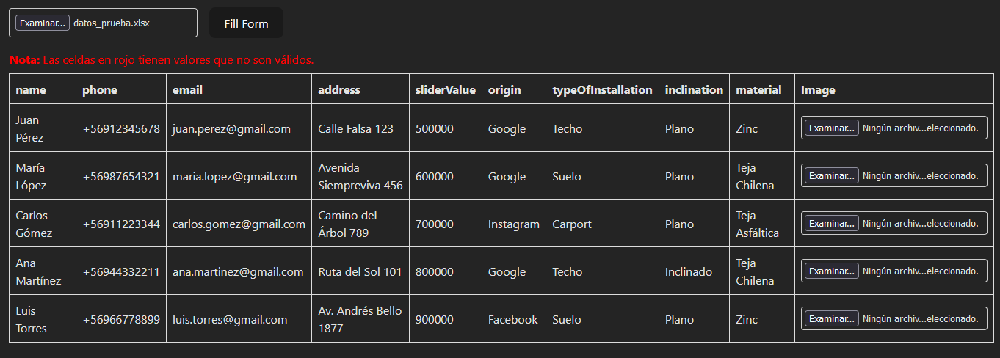

## Instrucciones para Ejecutar el Código

Este proyecto automatiza el llenado de un formulario web utilizando Puppeteer y permite cargar datos desde un archivo Excel. A continuación, se describen los pasos necesarios para ejecutar el código, el formato esperado del archivo Excel.

### Requisitos Previos

1. **Node.js y npm**: Asegúrate de tener instaladas todas las dependencias.
2. **Dependencias**: Instala las dependencias necesarias ejecutando:
   ```bash
   npm install
   ```
3. **Ejecutar el código**:
   ```bash
   npm run dev
   ```
   Al ejecutar este comando, el proyecto se iniciará y podrás acceder a la página en la dirección:
   [http://localhost:5173/](http://localhost:5173/)

---


### **1. Subir el archivo Excel:**
- Haz clic en el botón **"Examinar..."**.
- Selecciona un archivo Excel desde tu dispositivo. Este archivo debe contener los datos organizados en columnas como: `name`, `phone`, `email`, `address`, `sliderValue`, `origin`, `typeOfInstallation`, `inclination`, y `material`.



### **2. Revisar y asignar imágenes opcionales:**
- Una vez cargado el Excel, la tabla se rellenará automáticamente con los datos.
- En la última columna **"Image"**, puedes asignar una imagen para cada fila:
  - Haz clic en el botón **"Examinar..."** de la celda correspondiente.
  - Selecciona un archivo de imagen desde la carpeta `assets` en tu proyecto.
  - La imagen es opcional, pero si se asigna, aparecerá en esa fila.

### **3. Validar datos en la tabla:**
- Las celdas que tienen datos inválidos o faltantes estarán marcadas en **rojo**.
- Antes de proceder, corrige los datos en la fuente (Excel) o en la tabla para asegurar que todo es válido.

### **4. Llenar el formulario:**
- Una vez que todo esté listo, presiona el botón **"Fill Form"**.
- Esto abrirá un navegador y, usando Puppeteer:
  - Cada fila de datos se procesará uno por uno.
  - Los campos del formulario correspondiente en el navegador se llenarán automáticamente con la información de la tabla.
  - Si se cargaron imágenes, estas también se incluirán en el formulario.

---

## Formato del Archivo Excel

El archivo Excel debe contener los siguientes encabezados en la primera fila:

| Name           | Phone          | Email                 | Address                 | Slider Value | Origin    | Type of Installation | Inclination | Material        |
|----------------|----------------|-----------------------|-------------------------|--------------|-----------|----------------------|-------------|-----------------|
| Juan Pérez     | +56912345678   | juan.perez@gmail.com  | Calle Falsa 123         | 500000       | Google    | Techo               | Plano       | Zinc            |
| María López    | +56987654321   | maria.lopez@gmail.com | Avenida Siempreviva 456 | 600000       | Google    | Suelo               | Plano       | Teja Chilena    |
| Carlos Gómez   | +56911223344   | carlos.gomez@gmail.com| Camino del Árbol 789    | 700000       | Instagram | Carport             | Plano       | Teja Asfáltica  |
| Ana Martínez   | +56944332211   | ana.martinez@gmail.com| Ruta del Sol 101        | 800000       | Google    | Techo               | Inclinado   | Teja Chilena    |
| Luis Torres    | +56966778899   | luis.torres@gmail.com | Av. Andrés Bello 1877   | 900000       | Facebook  | Suelo               | Plano       | Zinc            |

- **`origin`**, **`typeOfInstallation`**, **`inclination`** y **`material`** deben tener valores válidos para el formulario (en caso contrario las celdas aparecerán de color rojo).
